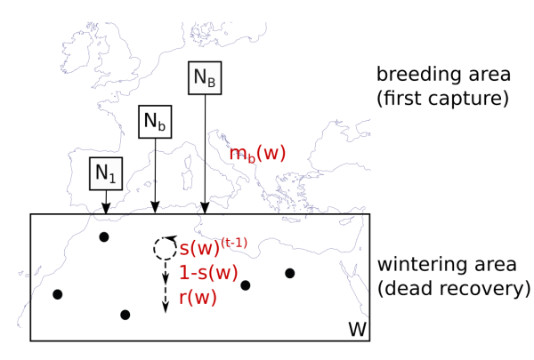
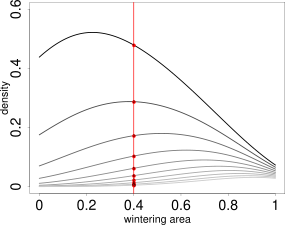
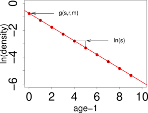

```{r, include = FALSE}
knitr::opts_chunk$set(
  collapse = TRUE,
  comment = "#>"
)
```

# Estimating Parameters Using The Continuous Approach

## Installation instruction

Install the package with all its dependencies:

```{r eval=FALSE}
install.packages(pkgs= paste(getwd(),"/CONSURE_0.0.0.9000.tar.gz",sep=""), 
                 repos = NULL, type ="source", dependencies = TRUE)
```

```{r setup}
library(CONSURE)
```


## The model

This model estimates the parameters survival, migratory connectivity and recovery probability from dead recoveries of marked animals. For an illustration see the figure below:



$N_b$ individuals are marked in every breeding area. They migrate to geographical coordinates in the wintering area, in such a way that individuals of one breeding population using geographically dispersed points in non-breeding space while the points of individuals of different breeding areas may be close to each other. We call the distribution of one breeding population in non-breeding space migratory connectivity from here on. When the individuals arrived in their non-breeding area, they survive year by year for t-1 years until they die with the inverse probability in year t. t corresponds to the age at death. Dead individuals are found by a certain recovery probability, which is constant over space. Survival and recovery probability is independent of breeding origin.


## Estimating the parameters

CONSURE can estimate the three parameters survival, migratory connectivity and recovery probability. This is possible in one- and two-dimensional space. The code is the same, but the functions need more computational time in two-dimensional space and the plots look different. Therefore, we show both possibilities here.

### One-dimensional space
We load simulated data as shown in the [vignette on simulating data](SimulatingData.html).

```{r}
B <- 3    # number of breeding areas

mro <- markRecaptureObject(xrange = c(0,1),
                    survival = function(w){0.5*w+.4},
                    recovery = function(w){0.1},
                    migratoryConnectivity = function(b,w,B=B){
                      truncnorm::dtruncnorm(w,0,1, 
                                            mean = seq(0.1,0.9,length.out = B)[b], 
                                            sd = 0.3)},
                    markedInds = rep(100000,B),
                    observationTime = 10, robust = TRUE)

mro <- simContin(mro)
```


 

{# custom} The model parameters are estimated from a kernel density estimate which looks like the picture on the left. This kernel density estimate has a layer for each age class (the first age class has the highest values, the last age class has the lowest values). The parameters are estimated by a log-linear model in every point. This means, in one point, we cut through all layers of the kernel density as indicated by the red line on the image on the left side. Then, we take the logarithm of the values and plot it against the age classes, as you can see on the right side. The intercept and the slope are functions of the model parameters. (Further reading in Schirmer et al. 2021, in prep.). Theoretically, it would be possible to estimate a value for every point in space. Unfortunately, there are infinite points in space, even on a very small segment. Therefore, we practically estimate values on a point grid, with a resolution high enough that we can visualize it as a continuous estimate, but small enough that computation time is short and storage small. To obtain a coarse overview we set the resolution to 100:

```{r}
res <- 100
```

#### The data

We use two subsets of the data. The first is the dead recoveries aggregated over all breeding areas. The raw data points facetted by age and area look like the following. Every cross represents a dead recovery. The x-axis is the point in space, where the dead-recovery was made. As space is one-dimensional, this is just a line, e.g., a river, a coast-line or a cross-section through two-dimensional space. The y-axis is the age at death, at which the dead recovery was made.

```{r fig.fullwidth=TRUE, fig.width=7}
plotRawRecoveries(mro, facetByAge = TRUE)
```

The second dataset contains the dead recoveries for each separate breeding area:
```{r fig.fullwidth=TRUE, fig.width=7}
 plotRawRecoveries(mro, facetByAge = TRUE, facetByArea = TRUE)
```


#### Estimating the aggregated kernel density


From these data points we estimate the kernel density of the dead recoveries in space-age at death-space. We need to do this twice. One time for the aggregated dataset over all breeding areas and one time for each breeding area separately. The result can be stored under the same name as the initialized markRecaptureObject:
```{r}
mro <- estKDE(mro, all = TRUE)
```

```{r fig.fullwidth=TRUE}
plotKDE("all", mro,trueValuesAvailable = TRUE)
```

#### Estimating survival

Based on the kernel density estimate for the aggregated dataset over all breeding areas we estimate survival using a log-linear model in age at death. Details can be found in Schirmer et al., 2021, in prep..

```{r warning=FALSE}
mro <- estS(markRecaptureObject = mro)
```

The robust estimation of the linear model often throws warnings when the algorithm does not converge. You should be careful if the number of warnings is a large amount of the resolution. Few warnings only can in most cases be considered harmless. You may consult the help page of robustbase::lmrob for more details.

The plot shows the estimated survival using a robust linear model. If we also want to visualize the true survival with which the data is simulated, the argument trueValuesAvailable must be set to TRUE:

```{r fig.fullwidth=TRUE}
plotS(mro, trueValuesAvailable = TRUE, zlim = c(0,1))
```


#### Estimating kernel density separately for each breeding area

To estimate migratory connectivity and recovery probability, we need a kernel density estimate for each breeding area. We do this by leaving the argument all set to FALSE as it is by default. We do not have to specify every breeding area by name. The function will estimate the kernel density for each breeding area automatically.

```{r}
mro <- estKDE(mro)
```

The plot for each breeding area can be plotted by adding its name to the plotKDE-function:
```{r fig.fullwidth=TRUE}
plotKDE("b3", mro,trueValuesAvailable = TRUE)
```

#### Estimating the migratory connectivity

Now, we can estimate the migratory connectivity by the technique described in Schirmer et al. (2021), in prep. for the aggregated dataset of all breeding areas:

```{r warning=FALSE}
mro <- estM(mro, all  = TRUE)
```

and plot its shape:

```{r fig.fullwidth=TRUE}
mP <- plotM(mro,"all", trueValuesAvailable = TRUE)
mP+ggplot2::ylim(0,2.5)
```

We can also estimate the migratory connectivity for each breeding area. It is estimated for all breeding areas simultaneously, so no breeding area name has to be specified.

```{r warning=FALSE}
mro <- estM(mro)
```

The plot for breeding area "b3" looks like the following:

```{r fig.fullwidth=TRUE}
mP <- plotM(mro,"b3", trueValuesAvailable = TRUE)
mP <- mP+ggplot2::ylim(0,2.5)
mP
```

You can plot the migratory connectivity for each breeding area by changing the breedingArea-argument to the name of the breeding area. (Plots for different breeding areas can be combined, e.g., by storing the plots in variables and using ggpubr::ggarrange.)

#### Estimating the constant recovery probability

Finally, we can estimate the recovery probability. It is a constant over the whole non-breeding area and does not depend on the breeding origin.
```{r}
mro <- estR(mro)

mro$estimates$r # estimated recovery probability
mro$winteringArea$recovery(0.5) # true recovery probability
```

The true recovery probability used to simulate the data is a function in space, although it is a constant over space. So, we obtain the true constant recovery probability by forward a point in space to the function. Here, we decided to choose the point (0.5). But every other point in non-breeding space would lead to exactly the same result.


### Two-dimensional space
We load simulated data as shown in the [vignette on simulating data](SimulatingData.html).

```{r}
B <- 3
mro2 <- markRecaptureObject(xrange = c(0,1),
                            yrange = c(0,1),
                            survival = function(w){-sum(0.2*w)+0.9},
                            recovery = function(w){0.1},
                            markedInds = rep(100000,B) ,
                            migratoryConnectivity = function(b,w,lb=0,ub=1,B=B){
                              tmvtnorm::dtmvnorm(w, mean = rep(seq(0.1,0.9,length.out = B)[b],2),
                                                 sigma = diag(0.3,2), lower = rep(lb,2),
                                                 upper = rep(ub,2))
                            },
                            observationTime = 10)

mro2 <- simContin(mro2)
```

The parameters are estimated in every point in space. For a more detailed explanation what this looks like see [the paragraph in one-dimensional space](# custom). In two-dimensional space, the layers are not longer curves, but planes. One point in space has two geographical coordinates and to obtain the same coverage as in one-dimensional space, we need the square of the one-dimensional resolution. Here, too, it would be theoretically possible to estimate a value for every point in space. Practically, we estimate values on a point grid, with a resolution high enough that we can visualize it as a continuous estimate, but small enough that computation time is short and storage small. To obtain a coarse overview we set the resolution to 100.

```{r}
res <- 100
```

This means, we choose a resolution in the direction of the x-axis of 100 and a resolution in the direction of the y-axis of 100. This results in a grid of 100 x 100 points. So, we estimate the parameters in 10000 points. We cannot choose different resolutions for x- and y-axis for technical reasons.

#### The data

We use two subsets of the data. The first data set is the dead recoveries aggregated over all breeding areas. It can be visualized with the function plotRawRecoveries. Note, in the moment you need internet connection for the background map, even if it is just simulated data. There are many data points in this data set. For better visibility, we only plot the age classes 7 to 10. This can be specified by ageMin and ageMax. The raw data points facetted by age and area look like the following:

```{r fig.fullwidth=TRUE, fig.width=7}
plotRawRecoveries(mro2, facetByAge = TRUE, ageMin = 7, ageMax = 10)
```

The second dataset contains the dead recoveries for each separate breeding area:
```{r fig.fullwidth=TRUE, fig.width=7}
 plotRawRecoveries(mro2, facetByAge = TRUE, facetByArea = TRUE, ageMin = 7, ageMax = 10)
```

#### Estimating the aggregated kernel density


From these data points we estimate the kernel density. We need to do this twice. One time for the aggregated dataset over all breeding areas and one time for each breeding area separately. The result can be stored under the same name as the initialized markRecaptureObject:
```{r}
mro2 <- estKDE(mro2, all = TRUE)
```

Note, that the plot function is not capable of plotting the true kernel density at the moment for the aggregated dataset and will throw a warning:

```{r fig.fullwidth=TRUE, fig.width=7}
plotKDE("all", mro2,trueValuesAvailable = TRUE, ageMax = 3)
```

#### Estimating survival

Having a density estimate for the aggregated dataset of breeding areas makes it possible to estimate survival. 
```{r warning=FALSE}
mro2 <- estS(markRecaptureObject = mro2)
```

The robust estimation of the linear model often throws warnings when the algorithm does not converge. You should be careful if the number of warnings is a large amount of the resolution. When it is only a few the effect is neglectable.

```{r fig.fullwidth=TRUE, fig.width=7}
plotS(mro2, trueValuesAvailable = TRUE)
```

#### Estimating the kernel density separately for each breeding area
To estimate migratory connectivity and recovery probability, we need a kernel density estimate for each breeding area:

```{r}
mro2 <- estKDE(mro2)
```

The plot for each breeding area can be plotted by adding its name to the plotKDE-function:
```{r fig.fullwidth=TRUE, fig.width=7}
plotKDE("b1", mro2,trueValuesAvailable = TRUE, ageMax = 3)
```

#### Estimating migratory connectivity

Now, we can estimate the migratory connectivity for the aggregated dataset of all breeding areas:

```{r warning=FALSE}
mro2 <- estM(mro2, all  = TRUE)
```

and plot its shape. Note, that the plot function is not capable of plotting the true migratory connectivity at the moment for the aggregated dataset and will throw a warning:

```{r fig.fullwidth=TRUE}
plotM(mro2,"all", trueValuesAvailable = TRUE)
```

We can also estimate the migratory connectivity for each breeding area. It is estimated for all breeding areas simultaneously, so no breeding area name has to be specified.

```{r warning=FALSE}
mro2 <- estM(mro2)
```

The plot for breeding area "b2" looks like the following:

```{r fig.fullwidth=TRUE, fig.width=7, fig.height=6}
plotM(mro2,"b2", trueValuesAvailable = TRUE)
```

The migratory connectivity can be plotted for each breeding area by changing the name of the breeding area. (Plots for different breeding areas can be combined, e.g., by storing the plots in variables and using ggpubr::ggarrange.)

#### Estimating the recovery probability

Finally, we can estimate the recovery probability. It is a constant over the whole non-breeding area and does not depend on the breeding origin. The estimated value is stored in estimates\$r. The true recovery probability function is stored under winteringArea\$recovery. For the latter we can choose an arbitrary value inside the non-breeding area to obtain the recovery probability as it is constant in every point.
```{r}
mro2 <- estR(mro2)

mro2$estimates$r # estimated recovery probability
mro2$winteringArea$recovery(c(0.5,0.5)) # true recovery probability
```
The true recovery probability used to simulate the data is a function in space, although it is a constant over space. So, we obtain the true constant recovery probability by forward a point in space to the function. Here, we decided to choose the point (0.5, 0.5). But every other point in non-breeding space would lead to exactly the same result.
