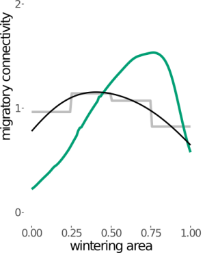
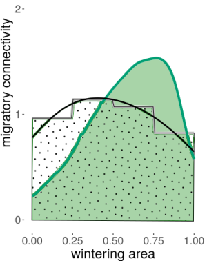
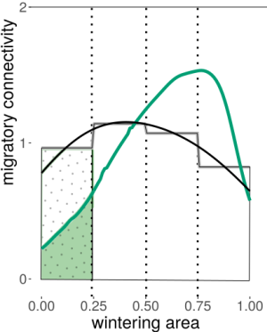
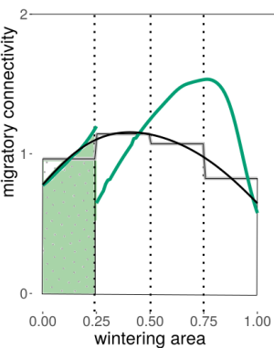
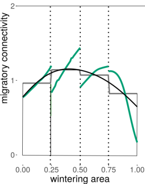
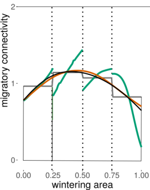

```{r, include = FALSE}

is_check <- ("CheckExEnv" %in% search()) || any(c("_R_CHECK_TIMINGS_",
             "_R_CHECK_LICENSE_") %in% names(Sys.getenv()))

knitr::opts_chunk$set(
  collapse = TRUE,
  comment = "#>",
  eval = !is_check
)
```

```{r setup}
library(CONSURE)
```

# Estimating parameters using the combined approach

The combined approach results in spatially continuous values for survival and migratory connectivity and it allows the recovery probability to vary over space. Be aware that the combined approach needs considerable more computational time. It combines estimates in discrete non-breeding space and estimates from the continuous approach by optimizing a function to fit both estimates as good as possible.

## Short illustration of how the method works

To shortly illustrate, how the combined method works, we look at a dataset in one-dimensional space, where recovery probability is increasing over space (from 0 to 1). This is only for a basic understanding. The method uses penalized M-splines. If you are interested in the details, you can read the dissertation (Schirmer, in prep.)


:::: {style="display: flex;"}

::: {}

```{r 0comb, echo=FALSE}

```
:::

::: {}

<br><br><br><br>The continuous approach gives us a continuous estimate for migratory connectivity (green line) assuming a constant recovery probability. If the recovery probability is not constant, the continuous estimate is shifted compared to the true migratory connectivity (black line). Alternatively, we can estimate migratory connectivity for a small number of discrete areas (here: 4). The discrete migratory connectivity is just the proportions, in which one breeding area is distributed between the discrete wintering areas. They are not shifted if recovery probability varies, but they are constant in each area. This results in a step-function (grey line). Now, we want to combine both estimates to obtain a continuous and unbiased estimate of migratory connectivity if recovery probability is not constant.
:::

::::

:::: {style="display: flex;"}
::: {}
```{r 1comb, echo=FALSE}

```
:::

::: {}

<br><br><br><br>
<br><br>

This is possible, because the area under every migratory connectivity curve is one. No matter, if it is the true migratory connectivity, the continuous or the discrete estimate. So, in the figure on the left, the green area under the continuous curve (green) and the dotted area under the step-function (grey) is the same.
:::

::::


:::: {style="display: flex;"}
::: {}
```{r 2comb, echo=FALSE}

```
:::

::: {}
<br><br><br><br><br><br>Now, we partition the wintering space (the x-axis) into four discrete areas. When we only consider one area, the area under the curve for the step-function (dotted area) and the area under the continuous function (green) should also be the same. Obviously, the green area is much smaller than the dotted area, because the continuous estimate is biased by the increasing recovery probability.
:::

::::

:::: {style="display: flex;"}
::: {}
```{r 3comb, echo=FALSE}

```
:::

::: {}
<br><br><br><br>
<br><br><br><br>We can achieve that the green and the dotted area are the same, when we cut the continuous function (green) at the border of the discrete wintering area and shift it upwards until the area under the shifted curve is the same as the dotted area.
:::

::::

:::: {style="display: flex;"}
::: {}
```{r 4comb, echo=FALSE}

```

:::

::: {}
<br><br><br><br><br><br><br><br> We repeat to cut and shift the continuous curve for all discrete wintering area. The resulting curve is continuous in one discrete wintering area but it is discontinuous at the borders.
:::

::::

:::: {style="display: flex;"}
::: {}
```{r 5comb, echo=FALSE}

```

:::

::: {}
<br><br><br><br><br><br><br><br>To obtain a continuous curve, we smooth the cut and shifted curve. This results in the combined estimate (orange).
:::

::::

To conclude, we need as input data to obtain combined estimates:
 
 * a continuous estimate of migratory connectivity
 * the boundaries of the discrete wintering areas
 * a discrete estimate of migratory connectivity (the proportions)

The output is:

  * a combined estimate for migratory connectivity
  * a combined estimate for the recovery probability
  
The combined approach does not change the survival estimates obtained by the continuous approach. Therefore, we do not discuss survival in this vignette. See [the vignette on how to estimate parameters using the continuous approach](EstimatingParameters.html) instead.

## One-dimensional space

### Simulated data

The example datasets for the continuous approach are simulated with a linearly increasing recovery probability over space. The data are simulated as described in the [vignette on simulating data](SimulatingDataWithCONSURE.html). The constructor in one-dimensional space looks like the following:

```{r 1d, warning=FALSE, cache=TRUE}
B <- 3
mro <- mark_recapture_object(
  xrange = c(0, 1),
  survival = function(w) {
    stmp <- function(w) 0.5 * w + .4
    stmp(w / 100222.8)
  },
  recovery = function(w) {
    rtmp <- function(w) 0.2 * w + 0.01
    rtmp(w / 100222.8)
  },
  migratory_connectivity = function(b, w, B = B) {
    mtmp <- function(b, w, B = B) {
      truncnorm::dtruncnorm(w, 0, 1,
        mean = seq(0.1, 0.9,
          length.out = B
        )[b],
        sd = 0.3
      )
    }
    mtmp(b, w / 100222.8, B)
  },
  marked_individuals = rep(100000, B),
  observation_time = 10, robust = TRUE
)

mro <- sim_contin(mro)
mro <- est_parameters(mro, res = 100)
```

Additionally, a split-vector specifies which point belongs to which discrete non-breeding area. Therefore, the length of the split-vector must equal the spatial resolution of the data. In the example, the one-dimensional space is split into 4 different non-breeding areas and the spatial resolution of the data is 0.01, which corresponds to 100 equally spaced values along the x-axis (excluding 0).

```{r split}
split <- rep(1:4, each = 25)
```


The true values of the parameters can be visualized with the function plotMsr:

```{r plot_raw_parameters, fig.fullwidth=TRUE, fig.width=7, fig.height=5}
plot_msr(mro, ylim = c(0, 2.5))
```

Note, that the raw probability to die is $1-s$, which is the inverse of the survival probability. In the plot above, this would be just a curve with the negative slope of the survival curve. However, an individual survives first year by year until it dies and the number of survived years differ between the individuals. Therefore, the probability to die over all time steps is a better indicator on how the pattern of dead recoveries will look like in space. The probability to die over all time steps means, that we sum the probability to die in each possible time step: $\sum_{t=1}^T s^{t-1}(1-s) = 1-s^T$. The equal sign applies because it is the partial sum of a geometric series. So, in our example, in 10 years observation time, the probability to die decreases especially near one.

The raw data looks like the following

```{r plot_raw_recoveries, fig.fullwidth=TRUE, fig.width=7}
plot_raw_recoveries(mro, facet_by_age = TRUE)
```

### Estimating the parameters

Firstly, the continuous parameters must be estimated as described in the vignette on estimating continuous parameters.

Secondly, we must define the boundaries of the discrete non-breeding areas. In the moment, this is only possible, when the non-breeding areas are of rectangular shape. The vector knots_prop contains in one-dimensional space the knots separating the discrete non-breeding areas.

```{r knots_prop}
knots_prop <- list(
  latitude = seq(0, 100222.8, le = 5),
  longitude = NULL
)
```

Thirdly, we need discrete estimates for migratory connectivity or proportions derived from external data or the true proportions derived from the true migratory connectivity function of simulated data. The latter can be calculated using the functions of the package CONSURE, while the former options can be forwarded directly in a later step.

If (and only if) we have simulated data and know the true migratory connectivity function, we can calculate the discrete migratory connectivity (the proportion) in every non-breeding area.

Now, the integral under the true migratory connectivity for every non-breeding area is calculated and stored in the breedingArea-object of the markRecaptureObject.

```{r calcm}
mro <- calc_discrete_m(mro, knots_prop = knots_prop)
mro$origins$all$m_discrete
```

Now, we need to initialize an optimization_object for the optimization. We forward the mark_recapture_object, the name of the breeding area to be optimized, the split-vector and a vector for lambda. The first entry in this vector is the weight for the smoothing penalty. The second entry is the weight for the penalty of the discrete value. The values are chosen arbitrarily. Which values to choose is not straightforward. Too high values for $\lambda_1$ will lead to a linear combined migratory connectivity estimate. Too low values will lead to a highly variable estimate. How $\lambda_1$ affects the estimate also depends on the value of $\lambda_2$. If $\lambda_2$ is set too low, but $\lambda_1$ enables a good fit (not too smooth, but not too wiggly), then the estimate will be close to the continuous estimate of migratory connectivity and not fit the discrete area under the curve. If $\lambda_2$ is set too high, it will only reflect the smoothing of the histogram given by the discrete values. Nevertheless, the true underlying curve may be just the smoothing of the histogram, e.g., in the case of a normal distribution shown in the example.
```{r optimobj}
o_o <- optimization_object(
  mark_recapture_object = mro,
  b = "all",
  split = split,
  lambda = c(.000005, 300)
)
```

Now, we start the optimization. The changeR-argument should be set to TRUE, when the optimization is for the aggregated dataset (breeding area "all"). Then, the combined estimate for the recovery probability will be estimated additionally to the migratory connectivity and the continuous migratory connectivity estimators will be corrected for the overall combined migratory connectivity and stored under markRecaptureObject$estimates$mCorrected. The arguments startTimes, maxit and reltol belong to the optim-function. For additional information see ?optim. The optimization algorithm should be started several times to prevent the process from getting stuck in local minima. If running combEstimate again reveals a different result, the number of startTimes should be set higher. Depending on the data structure the optimization algorithm will not converge in the maximum iterations. Then, we can simply increase the number of maxit. The reltol argument should be neither too high nor too low. The default value should be ok in most cases. 
```{r combest}
tmp <- comb_estimate(o_o,
  start_times = 10, maxit = 100000, reltol = 1e-8,
  change_r = TRUE
)
```

The output of comb_estimate contains the mark_eecapture_object with the combined estimates. Additionally, it contains a data.frame with the results from every repetition of the optim-function. The vector val contains the values of the repetitions.
```{r str}
str(tmp, max.level = 1)
```

For the further analysis, the markRecaptureObject from the output must be saved in the initial markRecaptureObject.

```{r init}
mro <- tmp$mark_recapture_object
```

The combined estimator of the migratory connectivity can be visualized using the plot_comb_m-function. The breeding area to be plotted is hidden in the optimization_object. So, check the value of optimization_object$b if another breeding area seems to be plotted than you expect.
```{r mplotall}
m_plot_all <- plot_comb_m(mro, o_o, zlim = c(0, 2.6))
```

The combined estimator of the recovery probability can be visualized using the plotCombM-function.

```{r rplotall}
r_plot_all <- plot_comb_r(mro, o_o)
```

To obtain the estimates for each area of origin, change the optimization name. Unless there is a very big sample size for each area of origin, set the argument use_corrected_m to TRUE. This will correct
the continuous estimate by the combined estimate for all areas of origin above. Moreover, set the argument change_r in the function comb_estimate to FALSE (default setting), so that the recovery probability is not estimated for every area of origin.
```{r optim_eacharea}
o_o <- optimization_object(
  mark_recapture_object = mro,
  b = "b1",
  split = split,
  lambda = c(.000005, 300),
  use_corrected_m = TRUE
)

tmp <- comb_estimate(o_o,
  start_times = 10, maxit = 100000, reltol = 1e-8,
  change_r = FALSE
)

mro <- tmp$mark_recapture_object

plot_comb_m(mro, o_o, pdf = TRUE, zlim = c(0, 2.6), est_corrected = TRUE)
```

## Two-dimensional space

```{r 2d, warning = FALSE, cache = TRUE}
B <- 3
mro2 <- mark_recapture_object(
  xrange = c(0, 1),
  yrange = c(0, 1),
  survival = function(w) {
    stmp <- function(w) {
      -sum(0.25 * w) + 0.9
    }
    stmp(c(w[1] / 100222.8, w[2] / 123642.5))
  },
  recovery = function(w) {
    rtmp <- function(w) sum(0.2 * w[1]) + 0.01
    rtmp(c(w[1] / 100222.8, w[2] / 123642.5))
  },
  marked_individuals = rep(100000, B),
  migratory_connectivity = function(b, w, lb = 0, ub = 1, B = B) {
    mtmp <- function(b, w) {
      tmvtnorm::dtmvnorm(w,
        mean = c(c(0.1, 0.5, 0.9)[b], c(0.1, 0.5, 0.9)[b]),
        sigma = diag(0.05, 2), lower = rep(lb, 2),
        upper = rep(ub, 2)
      )
    }
    mtmp(b, c(w[1] / 100222.8, w[2] / 123642.5))
  },
  observation_time = 10
)

mro2 <- sim_contin(mro2)
# save(mro2, file = "mro2_paper.Rdata")
mro2 <- est_parameters(mro2, res = 100)
```

The split-vector may look like the following:
```{r split2d}
split <- c(rep(rep(1:2, each = 50), 50), rep(rep(3:4, each = 50), 50))
```

```{r plotmsr2d, fig.fullwidth=TRUE, fig.width=7, fig.height=5}
plot_msr(mro2)
```
```{r knotsprop2d}
knots_prop <- list(
  latitude = seq(0, 100222.8, le = 3),
  longitude = seq(0, 123642.5, le = 3)
)

mro2 <- calc_discrete_m(mro2, knots_prop)

o_o <- optimization_object(
  mark_recapture_object = mro2,
  y = list(
    longitude = seq(0, 100222.8, le = 100),
    latitude = seq(0, 123642.5, le = 100)
  ),
  knots = list(
    longitude = seq(0, 100222.8, le = 10),
    latitude = seq(0, 123642.5, le = 10)
  ),
  b = "all",
  split = split,
  lambda = c(.001, 10), use_corrected_m = FALSE
)

tmp <- comb_estimate(optimization_object = o_o, maxit = 100000000, start_times = 10, reltol = 1e-8, change_r = TRUE)

mro2 <- tmp$mark_recapture_object

plot_comb_m(mro2, o_o)
plot_comb_r(mro2, o_o)


num <- 3
b <- paste("b", num, sep = "")

o_o <- optimization_object(
  mark_recapture_object = mro2,
  y = list(
    longitude = seq(0, 100222.8, le = 100),
    latitude = seq(0, 123642.5, le = 100)
  ),
  knots = list(
    longitude = seq(0, 100222.8, le = 10),
    latitude = seq(0, 123642.5, le = 10)
  ),
  b = b,
  split = split,
  lambda = c(1, 10), use_corrected_m = TRUE
)

# oO$gradient <- NULL

system.time({
  tmp <- comb_estimate(optimization_object = o_o, maxit = 1000000, start_times = 10, reltol = 1e-8)
})

mro2 <- tmp$mark_recapture_object

- # save(mro2, split, "mro2Increasing.Rdata")

  # Figure 4.9
  plot_comb_m(mro2, oO)
```
